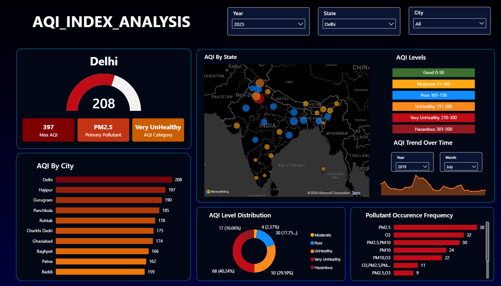

# AQI Analysis Dashboard

## Overview
This project is an interactive Air Quality Index (AQI) dashboard built using Microsoft Power BI. It analyzes air pollution levels across cities and states, highlights key pollutants, and shows trends over time.

## Key Features
- AQI comparison by city and state  
- Pollutant analysis (PM2.5, PM10, etc.)  
- AQI category distribution  
- Time-based trend analysis  
- Interactive filters (Year, State, City)

## Dashboard Preview

Insights
- Delhi shows very high AQI levels (Very Unhealthy category)
- PM2.5 is the dominant pollutant affecting air quality
- AQI levels across different cities and states can be analyzed by year
- AQI trends over time are visualized for better understanding of patterns

## Live Dashboard
https://app.powerbi.com/view?r=eyJrIjoiY2UzODk1NDktMDVlZi00Y2EwLWJiMjktMjUxZTdmNWNhOGM5IiwidCI6ImQxZjE0MzQ4LWYxYjUtNGEwOS1hYzk5LTdlYmYyMTNjYmM4MSIsImMiOjEwfQ%3D%3D
